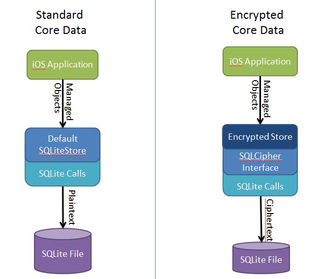
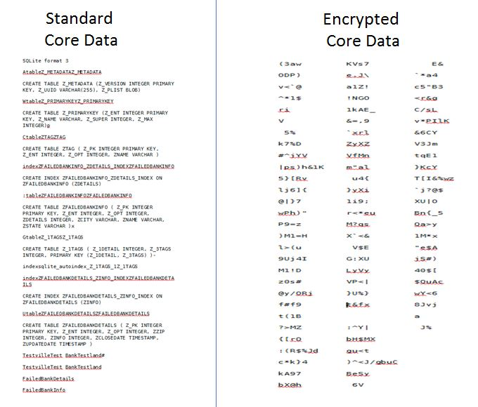

# Encrypted Core Data SQLite Store [](https://travis-ci.org/project-imas/encrypted-core-data)[]()


Provides a Core Data store that encrypts all data that is persisted.  Besides the initial setup, the usage is exactly the same as Core Data and can be used in existing projects that use Core Data.

# Vulnerabilities Addressed

1. SQLite database is not encrypted, contents are in plain text
  - CWE-311: Missing Encryption of Sensitive Data
2. SQLite database file protected with 4 digit system passcode
  - CWE-326: Inadequate Encryption Strength
  - SRG-APP-000129-MAPP-000029  Severity-CAT II: The mobile application must implement automated mechanisms to enforce access control restrictions which are not provided by the operating system

# Project Setup
  * When creating the project make sure **Use Core Data** is selected
  * Switch into your project's root directory and checkout the encrypted-core-data project code
```
    cd ~/Documents/code/YourApp

    git clone https://github.com/project-imas/encrypted-core-data.git
```
  * Click on the top level Project item and add files ("option-command-a")
  * Navigate to **encrypted-core-data**, highlight **Incremental Store**, and click **Add**

  * SQLCipher is added as a git submodule within ECD. A `git submodule init` and `git submodule update` should populate the sqlcipher submodule directory, where the `sqlcipher.xcodeproj` can be found and added to your project.
  * To use CommonCrypto with SQLCipher in Xcode:
    - add the compiler flags `-DSQLCIPHER_CRYPTO_CC` and `-DSQLITE_HAS_CODEC` under the sqlcipher project settings > Build Settings > Custom Compiler Flags > Other C Flags
    - Under your application's project settings > Build Phases, add `sqlcipher` to Target Dependencies, and `libsqlcipher.a` and `Security.framework` to Link Binary With Libraries.
    
* _Note:_ Along with the move to CommonCrypto, we've updated the version of SQLCipher included as a submodule from v2.0.6 to v3.1.0. Databases created with v2.0.6 will not be able to be read directly by v3.1.0, and support for legacy database migration is not yet supported by ECD.

# Installation via CocoaPod
* If you don't already have CocoaPods installed, do `$ sudo gem install cocoapods` in your terminal. (See the [CocoaPods website](http://guides.cocoapods.org/using/getting-started.html#getting-started) for details.)
* In your project directory, do `pod init` to create a Podfile.
* Add `pod 'EncryptedCoreData', :git => 'https://github.com/project-imas/encrypted-core-data.git'` to your Podfile
* Run `pod install`
* In your application delegate source file (AppDelegate.m), add `#import "EncryptedStore.h"`

# Using EncryptedStoreFileManager
In case of strong coupling with file system functions and others default conventions FileManager was introduced.

Have a look at components:

* EncryptedStoreFileManagerConfiguration
* EncryptedStoreFileManager

Various options are stored in Configuration.

And FileManager could be passed to all functions as an option.

```
NSDictionary *options = @{ EncryptedStore.optionFileManager : fileManager };
```

However, it should solve some dirty hacks.
Let's try.

## Database lives in different bundle.

```
NSBundle *bundle = [NSBundle bundleWithIdentifier:"com.opensource.database_framework"];
EncryptedStoreFileManagerConfiguration *configuration = [EncryptedStoreFileManagerConfiguration new];
configuration.bundle = bundle;

// or
[[EncryptedStoreFileManagerConfiguration alloc] initWithOptions: @{EncryptedStoreFileManagerConfiguration.optionBundle : bundle}];

// next, you need to bypassing configuration to setup store.
EncryptedStoreFileManager *fileManager = [[EncryptedStoreFileManager alloc] initWithConfiguration:configuration];
NSDictionary *options = @{ EncryptedStore.optionFileManager : fileManager };
```

## Complex setup and file system methods separation.

By default, database file (sqlite) is stored on disk in Application Support Directory.
But you can configure file extension, file name and file url in `EncryptedStoreFileManagerConfiguration`.

## Apply attributes to database file.
In general, this functionality is not needed.
It is a part of setup core data stack process.

## Configure persistentContainer
`NSPersistentContainer` uses NSPersistentStoreDescriptions to configure stores.

```
NSManagedObjectModel *model = [NSManagedObjectModel new];
NSPersistentContainer *container = [[NSPersistentContainer alloc] initWithName:@"abc" managedObjectModel:model];
NSDictionary *options = @{
                          self.optionPassphraseKey : @"123",
                          self.optionFileManager : [EncryptedStoreFileManager defaultManager]
};
NSPersistentStoreDescription *description = [self makeDescriptionWithOptions:options configuration:nil error:nil];

container.persistentStoreDescriptions = @[description];

[container loadPersistentStoresWithCompletionHandler:^(NSPersistentStoreDescription *description, NSError * error) {
    if (error) {
        NSLog(@"error! %@", error);
    }
}];
```

But if you wish:

```
EncryptedStore *store = // retrieve store from coordinator.

// set database file attributes
NSDictionary *attributes = // set attributes
NSError *error = nil;
[store.fileManager setAttributes:attributes ofItemAtURL:store.fileManager.databaseURL error:&error];

// inspect bundle
store.fileManager.configuration.bundle;
```


# Using EncryptedStore

EncryptedStore is known to work successfully on iOS versions 6.0 through 9.2.

If you wish to set a custom cache size and/or custom database URL:
create an NSDictionary to set the options for your EncryptedStore, replacing customPasscode, customCacheSize, and/or customDatabaseURL:
```objc
NSDictionary *options = @{ EncryptedStorePassphraseKey: (NSString *) customPasscode,
                           EncryptedStoreCacheSize: (NSNumber *) customCacheSize,
                           EncryptedStoreDatabaseLocation: (NSURL *) customDatabaseURL
                           };
```

In your application delegate source file (i.e. AppDelegate.m) you should see
```objc
NSPersistentStoreCoordinator *coordinator = [self persistentStoreCoordinator];
```
If you created an NSDictionary with custom options, replace that line with
```objc
NSPersistentStoreCoordinator *coordinator = [EncryptedStore makeStoreWithOptions:options managedObjectModel:[self managedObjectModel]];
```

Otherwise, replace that line with:
```objc
NSPersistentStoreCoordinator *coordinator = [EncryptedStore makeStore:[self managedObjectModel]:@"SOME_PASSCODE"];
```
making sure to replace "SOME_PASSCODE" with a passcode of your own.

Also in the same file add an import for EncryptedStore.h:
```objc
   #import "EncryptedStore.h"
```

If there are issues you can add `-com.apple.CoreData.SQLDebug 1` to see all statements encryted-cored-data generates be logged.

# Features

- One-to-one relationships
- One-to-many relationships
- Many-to-Many relationships (NEW)
- Predicates
- Inherited entities

Missing features and known bugs are maintained on the [issue tracker](https://github.com/project-imas/encrypted-core-data/issues?state=open)

# Diagram

Below is a diagram showing the differences between NSSQLiteStore and EncryptedStore.  Note that actual the SQLite calls are coupled fairly strongly with the layer wrapping it:



# Strings Comparison

Below is the output of doing the unix *strings* command on a sample applications .sqlite file.  As you can see, the default persistence store leaves all information in plaintext:



## License

Copyright 2012 - 2014 The MITRE Corporation, All Rights Reserved.

Licensed under the Apache License, Version 2.0 (the "License");
you may not use this work except in compliance with the License.
You may obtain a copy of the License at

    http://www.apache.org/licenses/LICENSE-2.0

Unless required by applicable law or agreed to in writing, software
distributed under the License is distributed on an "AS IS" BASIS,
WITHOUT WARRANTIES OR CONDITIONS OF ANY KIND, either express or implied.
See the License for the specific language governing permissions and
limitations under the License.

